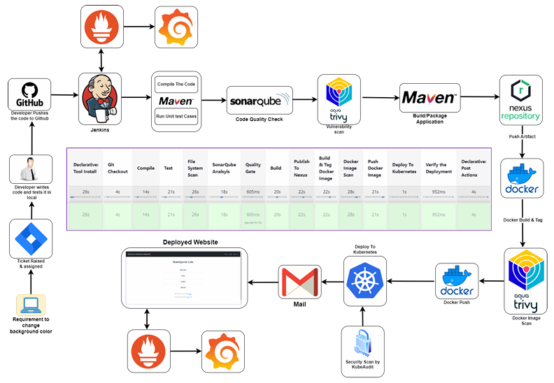

# 🚀 Ultimate DevOps CI/CD Pipeline Project

## 🌍 Introduction
Ce projet met en place une **pipeline CI/CD complète** pour une application cloud-native, intégrant **Terraform, Kubernetes, Jenkins, GitLab CI/CD, Docker, SonarQube, Nexus, Prometheus, Grafana et Trivy**.  

L'objectif est de démontrer **une expertise DevOps avancée** à travers l'automatisation complète du cycle de vie du déploiement applicatif.

---

## 📌 Technologies utilisées
- **Infrastructure as Code (IaC)** : Terraform, Kubernetes (EKS)
- **CI/CD** : Jenkins, GitLab CI/CD, Nexus (artifact repository)
- **Sécurité & Qualité** : SonarQube (Code Quality), Trivy (Image Scanning)
- **Monitoring & Observabilité** : Prometheus, Grafana
- **Containerisation & Orchestration** : Docker, Kubernetes
- **Automatisation** : Bash, Ansible

---

## 📜 Architecture du Projet
  
📌 *[Insérer une capture d’écran de l’architecture du projet]*

Le pipeline inclut :
1. **Provisioning** : Déploiement d'un cluster EKS avec Terraform.
2. **CI/CD** :
   - Code push → Analyse SonarQube → Build Maven → Stockage Nexus.
   - Build Docker → Scan Trivy → Push DockerHub → Déploiement Kubernetes.
3. **Monitoring** : Prometheus & Grafana assurent la supervision.

---

## ⚡ Mise en Place Pas à Pas

### 1️⃣ **Configuration de l’Infrastructure avec Terraform**
- Installer Terraform :
  ```bash
  sudo apt update && sudo apt install -y terraform
  ```
- Initialiser et appliquer la configuration :
  ```bash
  cd infrastructure/terraform
  terraform init && terraform apply -auto-approve
  ```
- Vérifier que l’infrastructure est bien créée :
  ```bash
  terraform output
  ```

### 2️⃣ **Installation et Configuration de Jenkins**
- Installer Jenkins sur une VM :
  ```bash
  cd ci-cd/jenkins
  bash install_jenkins.sh
  ```
- Accéder à Jenkins : `http://<IP-Jenkins>:8080`
- Récupérer le mot de passe initial :
  ```bash
  sudo cat /var/lib/jenkins/secrets/initialAdminPassword
  ```
- Installer les plugins nécessaires via l’interface Jenkins.

### 3️⃣ **Mise en place du pipeline CI/CD**
- Ajouter un fichier `Jenkinsfile` avec les étapes :
  - Checkout du code
  - Analyse SonarQube
  - Build Maven
  - Stockage Nexus
  - Build et push Docker
  - Déploiement Kubernetes
- Exécuter le pipeline et vérifier le succès des étapes.

### 4️⃣ **Déploiement des services Kubernetes**
- Appliquer les fichiers YAML :
  ```bash
  kubectl apply -f kubernetes/deployment.yaml
  kubectl apply -f kubernetes/service.yaml
  ```
- Vérifier les pods en cours d’exécution :
  ```bash
  kubectl get pods
  ```

### 5️⃣ **Configuration du Monitoring**
- Déployer Prometheus et Grafana :
  ```bash
  kubectl apply -f monitoring/prometheus.yaml
  kubectl apply -f monitoring/grafana.yaml
  ```
- Accéder à Grafana : `http://<IP-Grafana>:3000`
- Ajouter Prometheus comme source de données.

---

## 📊 Résultats et Tableau de Bord
### 🔎 **Analyse Code Quality avec SonarQube**
  
📌 *[Insérer une capture d’écran des résultats SonarQube]*

### 📦 **Pipeline CI/CD en action**
  
📌 *[Insérer une capture d’écran du pipeline Jenkins en exécution]*

### 📂 **Stockage des artifacts Nexus**
  
📌 *[Insérer une capture d’écran du repository Nexus]*

### 📈 **Monitoring avec Grafana**
  
📌 *[Insérer une capture d’écran du dashboard Grafana]*

### 📊 **Prometheus Metrics**
  
📌 *[Insérer une capture d’écran des métriques Prometheus]*

### 🌐 **Application Déployée**
  
📌 *[Insérer une capture d’écran de l’application en cours d’exécution]*

---

## 🛠 Améliorations Futures
✅ Intégration complète de **GitOps avec ArgoCD**.  
✅ Ajout de tests de charge avec **k6 et Locust**.  
✅ Renforcement de la sécurité avec **OPA et Falco**.  
✅ Optimisation du monitoring avec des alertes Grafana avancées.

---

## 🤝 Contact
👨‍💻 **Hrubech HOMBESSA**  
📧 [hrubechhombessa@gmail.com]  
🔗 [LinkedIn](https://www.linkedin.com/in/hrubech-hombessa/)  

---

💡 **Ce projet est conçu pour démontrer des compétences avancées en DevOps et CI/CD. N'hésitez pas à explorer, tester et contribuer !** 🚀